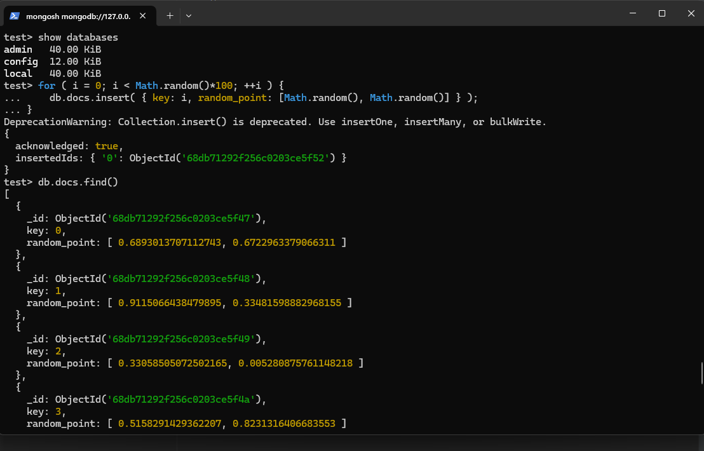
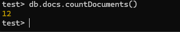

### Установка:
```shell
wget -qO - https://www.mongodb.org/static/pgp/server-8.0.asc | sudo apt-key add -  && echo "deb [ arch=amd64,arm64 ] https://repo.mongodb.org/apt/ubuntu noble/mongodb-org/8.0 multiverse" | sudo tee /etc/apt/sources.list.d/mongodb-org-8.0.list && sudo apt-get update && sudo DEBIAN_FRONTEND=noninteractive apt-get install -y mongodb-org
```
* создаем директории
```shell
sudo mkdir /home/mongo && sudo mkdir /home/mongo/db1 && sudo chmod 777 /home/mongo/db1
```
* запускаем
```shell
mongod --dbpath /home/mongo/db1 --port 27001 --fork --logpath /home/mongo/db1/db1.log --pidfilepath /home/mongo/db1/db1.pid
```
* Подключаемся к mongo
```shell
mongosh --port 27001
```
### Работа с коллекциями:
* Добавляем в коллекцию случайное количество элементов
```shell
for ( i = 0; i < Math.random()*100; ++i ) {
    db.docs.insert( { key: i, random_point: [Math.random(), Math.random()] } );
}
```

* Считаем количество элементов в коллекции
```shell
db.docs.countDocuments()
```
