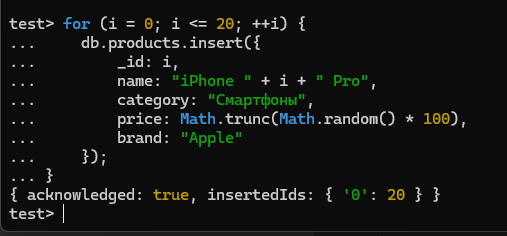
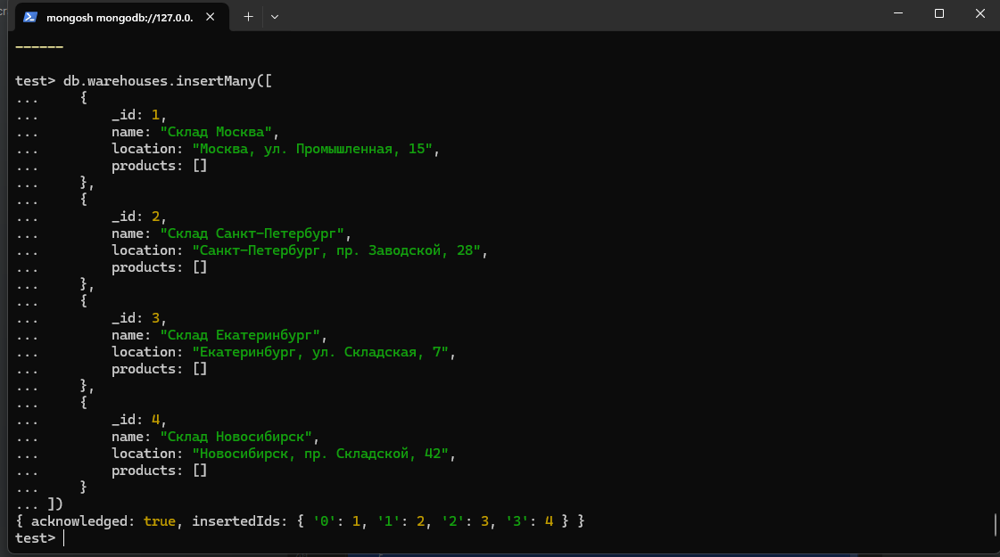
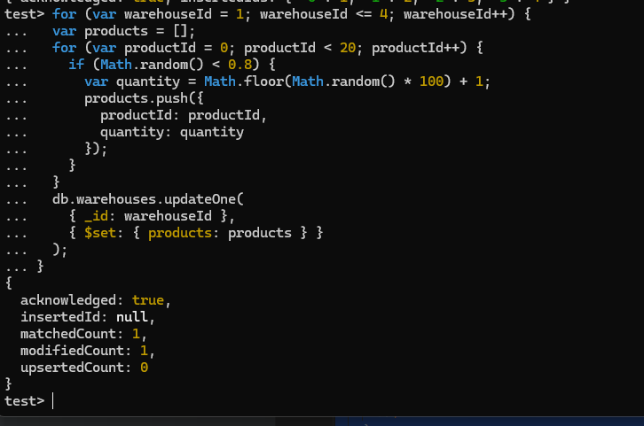
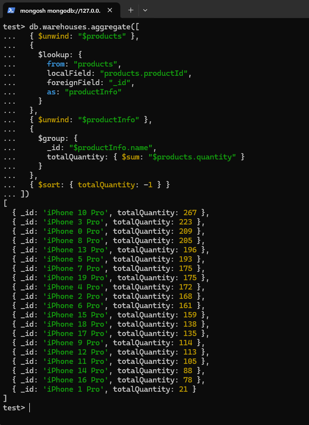

* Добавляем в коллекцию products товары
```js
for (i = 0; i <= 20; ++i) {
    db.products.insert({
        _id: i,
        name: "iPhone " + i + " Pro",
        category: "Смартфоны",
        price: Math.trunc(Math.random() * 100),
        brand: "Apple"
    });
}
```

* Добавляем в коллекцию warehouses
```js
db.warehouses.insertMany([
    {
        _id: 1,
        name: "Склад Москва",
        location: "Москва, ул. Промышленная, 15",
        products: []
    },
    {
        _id: 2,
        name: "Склад Санкт-Петербург",
        location: "Санкт-Петербург, пр. Заводской, 28",
        products: []
    },
    {
        _id: 3,
        name: "Склад Екатеринбург",
        location: "Екатеринбург, ул. Складская, 7",
        products: []
    },
    {
        _id: 4,
        name: "Склад Новосибирск",
        location: "Новосибирск, пр. Складской, 42",
        products: []
    }
])
```

* Заполняем рандомно склады товарами
```js
for (var warehouseId = 1; warehouseId <= 4; warehouseId++) {
  var products = [];
  for (var productId = 0; productId < 20; productId++) {
    if (Math.random() < 0.8) {
      var quantity = Math.floor(Math.random() * 100) + 1;
      products.push({
        productId: productId,
        quantity: quantity
      });
    }
  }
  db.warehouses.updateOne(
    { _id: warehouseId },
    { $set: { products: products } }
  );
}
```

* Пишем aggregation pipeline посчета товаров с суммой количества по всем складам, группировка по наименованию
```js
db.warehouses.aggregate([
  { $unwind: "$products" },
  {
    $lookup: {
      from: "products",
      localField: "products.productId",
      foreignField: "_id",
      as: "productInfo"
    }
  },
  { $unwind: "$productInfo" },
  {
    $group: {
      _id: "$productInfo.name",
      totalQuantity: { $sum: "$products.quantity" }
    }
  },
  { $sort: { totalQuantity: -1 } }
])
```
