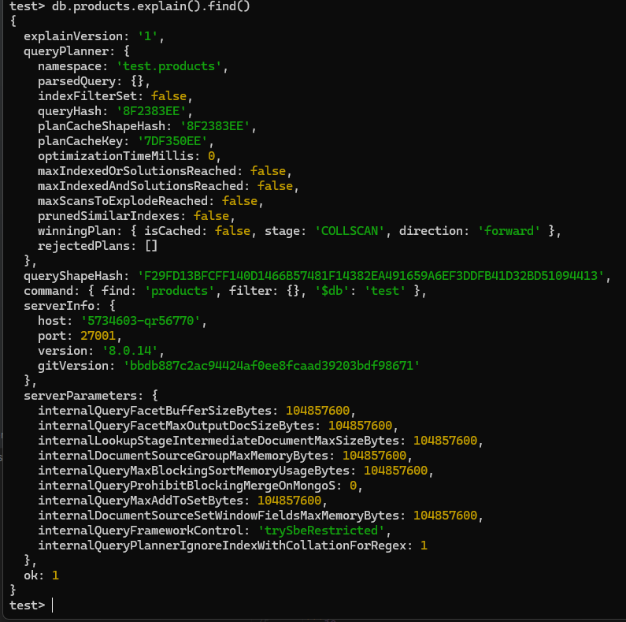

* Добавляем в коллекцию products товары
```js
for (i = 0; i <= 20; ++i) {
    db.products.insert({
        _id: i,
        name: "iPhone " + i + " Pro",
        category: "Смартфоны",
        price: Math.trunc(Math.random() * 100),
        brand: "Apple"
    });
}
```
* Делаем find() с explain() для коллекции products (пока без индексов)
```js
db.products.explain().find()
```

* Создаем индекс по name, предварительно проверяем какие индексы есть в коллекции
```js
db.products.getIndexes()
db.products.createIndex({name: 1})
```

* Делаем выборку по имени с explain()
```js
db.products.explain().find({ "name": "iPhone 1 Pro" })
```
