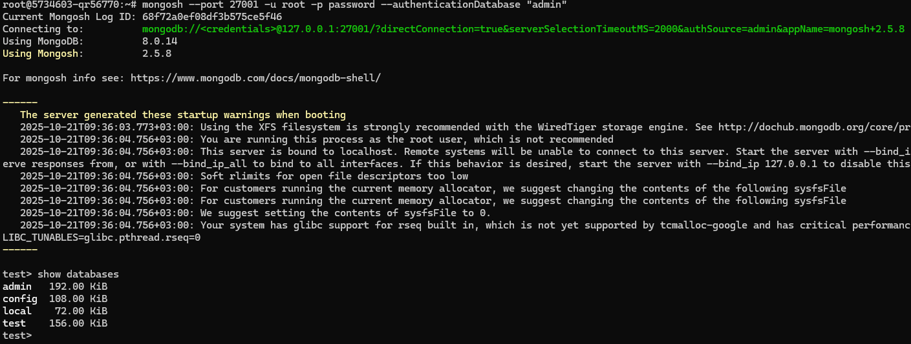

### Аутентификация:
```shell
mongosh --port 27001
```
* создаем роль и пользователя
```js
db1 = db.getSiblingDB("admin")
db1.createRole(
    {
        role: "su",
        privileges:[
            { resource: {anyResource:true}, actions: ["anyAction"]}
        ],
        roles:[]
    }
)
```
```js
db1.createUser({      
     user: "root",      
     pwd: "password",      
     roles: ["su"] 
})
```
* стоп сервера
```js
db1.shutdownServer()
```
* запускаем сервер с аутентификацией
```shell
mongod --dbpath /home/mongo/db1 --port 27001 --auth --fork --logpath /home/mongo/db1/db1.log --pidfilepath /home/mongo/db1/db1.pid
```
* пробуем подключиться без аутентификации посмотреть список DB
```shell
mongosh --port 27001
show databases
```


* подключаемся с аутентификацией
```shell
mongosh --port 27001 -u root -p password --authenticationDatabase "admin"
show databases
```


### Валидация, импорт\экспорт:
* импортируем данные
```shell
curl -o neighbourhoods.json "https://data.police.uk/api/leicestershire/neighbourhoods"
mongoimport --port 27001 -d test -c neighbourhoods --file neighbourhoods.json --jsonArray
```


* настройка валидации
```js
db.runCommand({
   collMod: "neighbourhoods",
   validator: {
     $jsonSchema: {
       bsonType: "object",
       required: ["id"],
       properties: {
         id: {
           bsonType: "string",
           description: "must be a string and max 5 characters",
           maxLength: 5
         }
       }
     }
   },
   validationLevel: "strict",
   validationAction: "error"
 })
```
* пробуем вставить невалидную запись
```js
db.neighbourhoods.insertOne( {id: "N432453", name: "Riverside"} )
```


### Бекап
```shell
sudo mkdir /home/mongobackups && sudo chmod 777 /home/mongobackups
sudo mongodump --port 27001 --db test --out /home/mongobackups/`date +"%m-%d-%y"`
```
