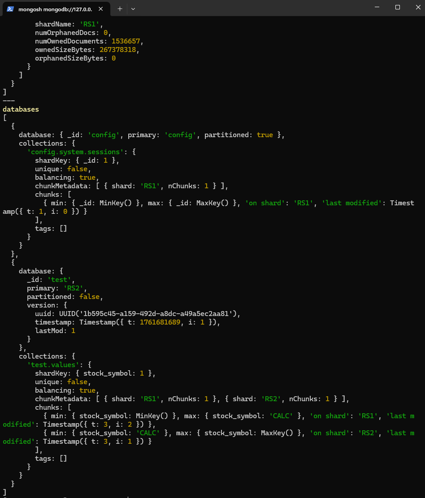
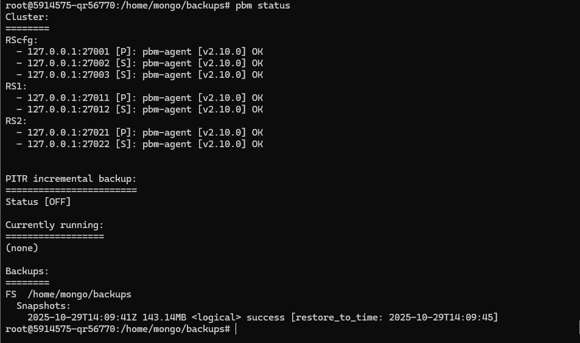
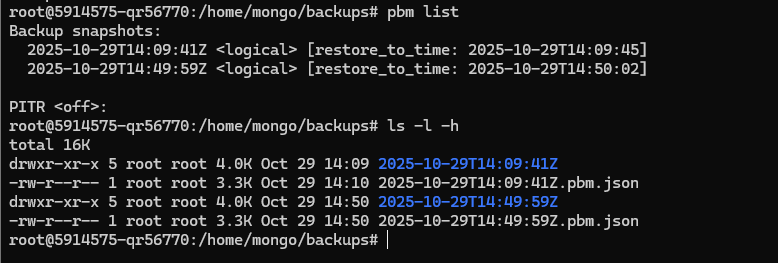

## Бекапы MongoDB с помощью pbm:
### Precondition: Развернуто два шарда Mongo DB по 2 реплики + конфиг + mongos. Загружены данные котировок stocks.zip
#### Установка mongo DB + percona mongoDB backup
```shell
sudo apt update && sudo DEBIAN_FRONTEND=noninteractive apt upgrade -y -q && curl -O https://repo.percona.com/apt/percona-release_latest.generic_all.deb && sudo DEBIAN_FRONTEND=noninteractive apt install -y gnupg2 lsb-release ./percona-release_latest.generic_all.deb && sudo apt update && sudo percona-release setup pdmdb-7.0 && sudo apt install -y percona-server-mongodb percona-backup-mongodb
```
* Кластер с данными stocks.zip, с шардированием по stock_symbol


* Запускаь pbm-agent к каждой ноде mongo в кластере
```shell
nohup pbm-agent --mongodb-uri "mongodb://127.0.0.1:27001" > /home/mongo/pbm/agent.$(hostname -s).27001.log 2>&1 &
nohup pbm-agent --mongodb-uri "mongodb://127.0.0.1:27002" > /home/mongo/pbm/agent.$(hostname -s).27002.log 2>&1 &
nohup pbm-agent --mongodb-uri "mongodb://127.0.0.1:27003" > /home/mongo/pbm/agent.$(hostname -s).27003.log 2>&1 &
nohup pbm-agent --mongodb-uri "mongodb://127.0.0.1:27011" > /home/mongo/pbm/agent.$(hostname -s).27011.log 2>&1 &
nohup pbm-agent --mongodb-uri "mongodb://127.0.0.1:27012" > /home/mongo/pbm/agent.$(hostname -s).27012.log 2>&1 &
nohup pbm-agent --mongodb-uri "mongodb://127.0.0.1:27021" > /home/mongo/pbm/agent.$(hostname -s).27021.log 2>&1 &
nohup pbm-agent --mongodb-uri "mongodb://127.0.0.1:27022" > /home/mongo/pbm/agent.$(hostname -s).27022.log 2>&1 &
```
Получаем такой статус pbm:

* Стартуем бекап с кластера
```shell
pbm backup
```
* Смотрим результат (два бекапа)
```shell
pbm list
```
