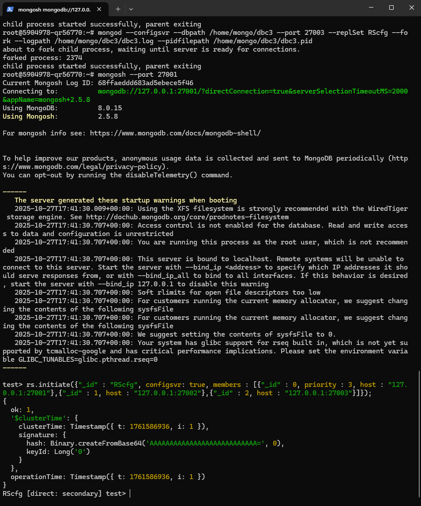
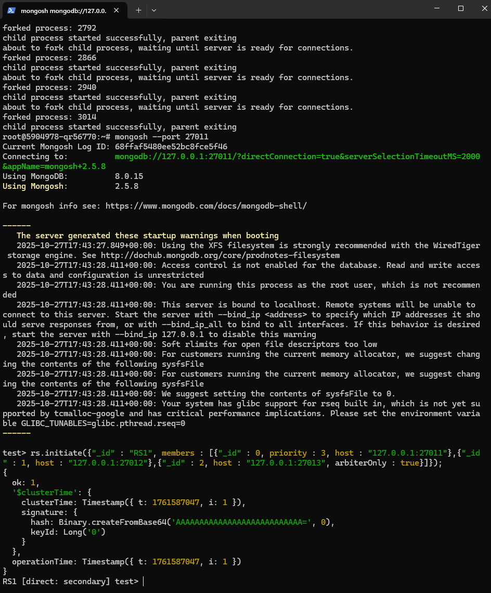
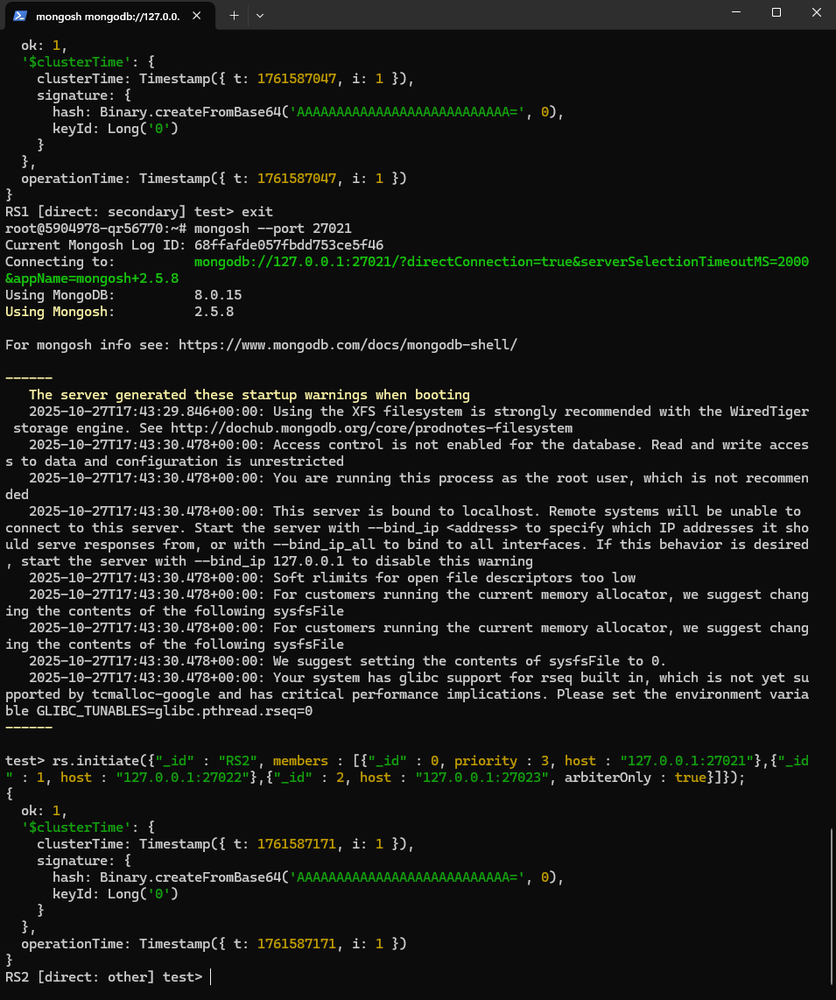
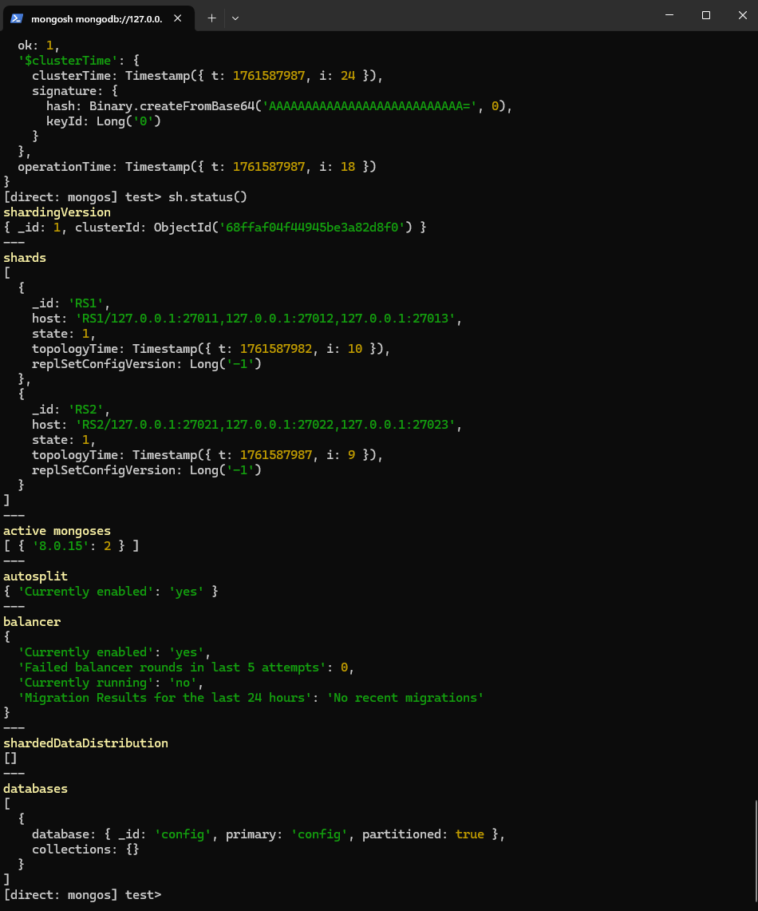
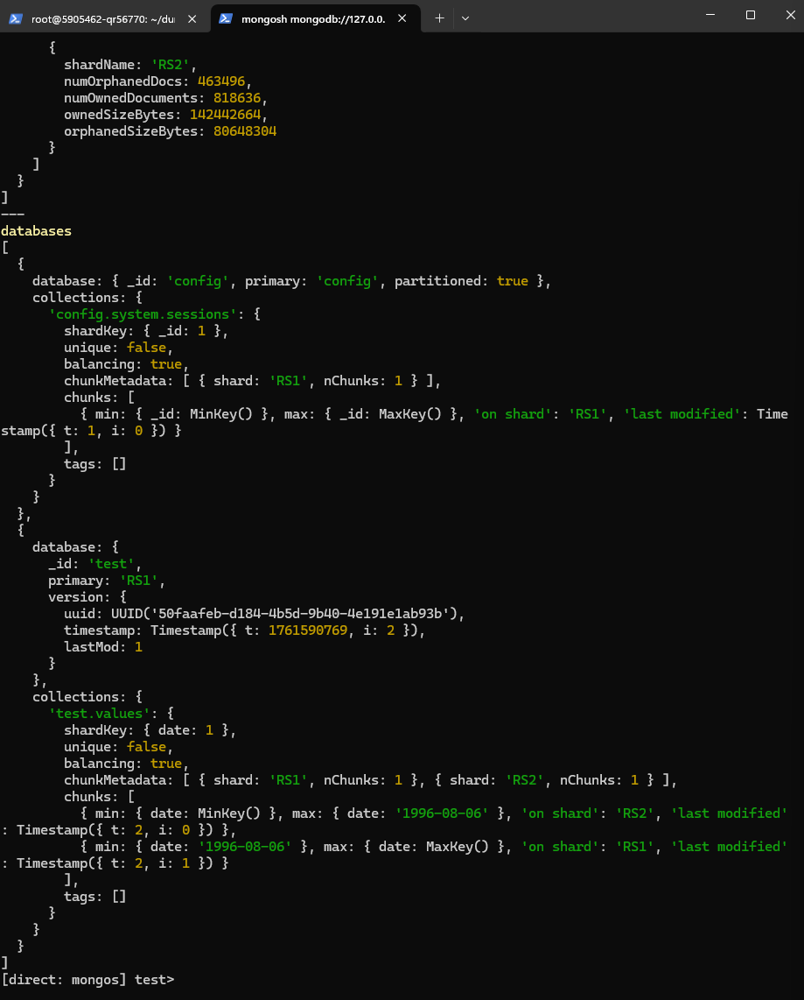
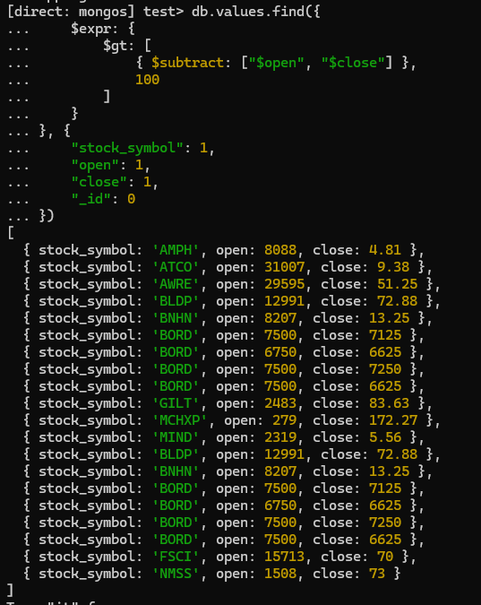
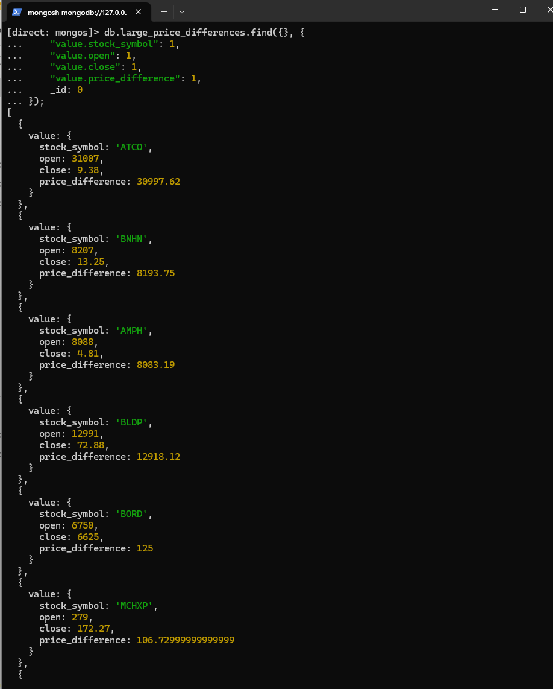

### Шардирование:

* Prcondition: MongoDB installed on the VM

* Создаем replica set для конфигурации
```shell
sudo mkdir /home/mongo && sudo mkdir /home/mongo/{dbc1,dbc2,dbc3} && sudo chmod 777 /home/mongo/{dbc1,dbc2,dbc3}
mongod --configsvr --dbpath /home/mongo/dbc1 --port 27001 --replSet RScfg --fork --logpath /home/mongo/dbc1/dbc1.log --pidfilepath /home/mongo/dbc1/dbc1.pid
mongod --configsvr --dbpath /home/mongo/dbc2 --port 27002 --replSet RScfg --fork --logpath /home/mongo/dbc2/dbc2.log --pidfilepath /home/mongo/dbc2/dbc2.pid
mongod --configsvr --dbpath /home/mongo/dbc3 --port 27003 --replSet RScfg --fork --logpath /home/mongo/dbc3/dbc3.log --pidfilepath /home/mongo/dbc3/dbc3.pid
mongosh --port 27001

rs.initiate({"_id" : "RScfg", configsvr: true, members : [{"_id" : 0, priority : 3, host : "127.0.0.1:27001"},{"_id" : 1, host : "127.0.0.1:27002"},{"_id" : 2, host : "127.0.0.1:27003"}]});
```

* Создадим 2 репликасета для последующего шардирования
```shell
sudo sudo mkdir /home/mongo/{db1,db2,db3,db4,db5,db6} && sudo chmod 777 /home/mongo/{db1,db2,db3,db4,db5,db6}
mongod --shardsvr --dbpath /home/mongo/db1 --port 27011 --replSet RS1 --fork --logpath /home/mongo/db1/db1.log --pidfilepath /home/mongo/db1/db1.pid
mongod --shardsvr --dbpath /home/mongo/db2 --port 27012 --replSet RS1 --fork --logpath /home/mongo/db2/db2.log --pidfilepath /home/mongo/db2/db2.pid
mongod --shardsvr --dbpath /home/mongo/db3 --port 27013 --replSet RS1 --fork --logpath /home/mongo/db3/db3.log --pidfilepath /home/mongo/db3/db3.pid
mongod --shardsvr --dbpath /home/mongo/db4 --port 27021 --replSet RS2 --fork --logpath /home/mongo/db4/db4.log --pidfilepath /home/mongo/db4/db4.pid
mongod --shardsvr --dbpath /home/mongo/db5 --port 27022 --replSet RS2 --fork --logpath /home/mongo/db5/db5.log --pidfilepath /home/mongo/db5/db5.pid
mongod --shardsvr --dbpath /home/mongo/db6 --port 27023 --replSet RS2 --fork --logpath /home/mongo/db6/db6.log --pidfilepath /home/mongo/db6/db6.pid
```
* Конфигурируем Первый Replica set RS1 с арбитром
```shell
mongosh --port 27011
rs.initiate({"_id" : "RS1", members : [{"_id" : 0, priority : 3, host : "127.0.0.1:27011"},{"_id" : 1, host : "127.0.0.1:27012"},{"_id" : 2, host : "127.0.0.1:27013", arbiterOnly : true}]});
```

* Конфигурируем второй Replica set RS2
```shell
mongosh --port 27021
rs.initiate({"_id" : "RS2", members : [{"_id" : 0, priority : 3, host : "127.0.0.1:27021"},{"_id" : 1, host : "127.0.0.1:27022"},{"_id" : 2, host : "127.0.0.1:27023", arbiterOnly : true}]});
```

#### Создадим шардированный кластер
* запускаем в 2 экземплярах mongos
```shell
mongos --configdb RScfg/127.0.0.1:27001,127.0.0.1:27002,127.0.0.1:27003 --port 27000 --fork --logpath /home/mongo/dbc1/dbs.log --pidfilepath /home/mongo/dbc1/dbs.pid 
mongos --configdb RScfg/127.0.0.1:27001,127.0.0.1:27002,127.0.0.1:27003 --port 27100 --fork --logpath /home/mongo/dbc1/dbs2.log --pidfilepath /home/mongo/dbc1/dbs2.pid 
```
* Добавляем шарды в кластер:
```shell
mongosh --port 27000
db.adminCommand( {
   "setDefaultRWConcern" : 1,
   "defaultWriteConcern" : {"w":1}
} )
sh.addShard("RS1/127.0.0.1:27011,127.0.0.1:27012,127.0.0.1:27013")
sh.addShard("RS2/127.0.0.1:27021,127.0.0.1:27022,127.0.0.1:27023")
sh.status()
```

* Добавляем данные 
```shell
wget https://dl.dropboxusercontent.com/s/p75zp1karqg6nnn/stocks.zip 
unzip -qo stocks.zip
mongorestore --port 27000 values.bson
```

* Шардируем по date (для эксперимента)
```shell
mongosh --port 27000
db.values.createIndex({date: 1})
sh.enableSharding("test")
sh.shardCollection("test.values",{ date: 1 })
sh.status()
```

* Выполняем запрос котировок с бальшой разницей открытия\закрытия
```js
db.values.find({
    $expr: {
        $gt: [
            { $subtract: ["$open", "$close"] },
            100
        ]
    }
}, {
    "stock_symbol": 1,
    "open": 1,
    "close": 1,
    "_id": 0
})
```

* Пробуем map reduce для такого же запроса (работает намного быстрее чем обычный find() на шардированном кластере)
```js
var mapFunction = function() {
    var priceDiff = this.open - this.close;
    if (priceDiff > 100) {
        emit(this._id, {
            stock_symbol: this.stock_symbol,
            open: this.open,
            close: this.close,
            price_difference: priceDiff
        });
    }
};

var reduceFunction = function(key, values) {
    return values[0];
};

db.values.mapReduce(
    mapFunction,
    reduceFunction,
    {
        out: "large_price_differences",
        query: {},
        scope: {},
        jsMode: true
    }
);


db.large_price_differences.find({}, {
    "value.stock_symbol": 1,
    "value.open": 1,
    "value.close": 1,
    "value.price_difference": 1,
    _id: 0
});
```
