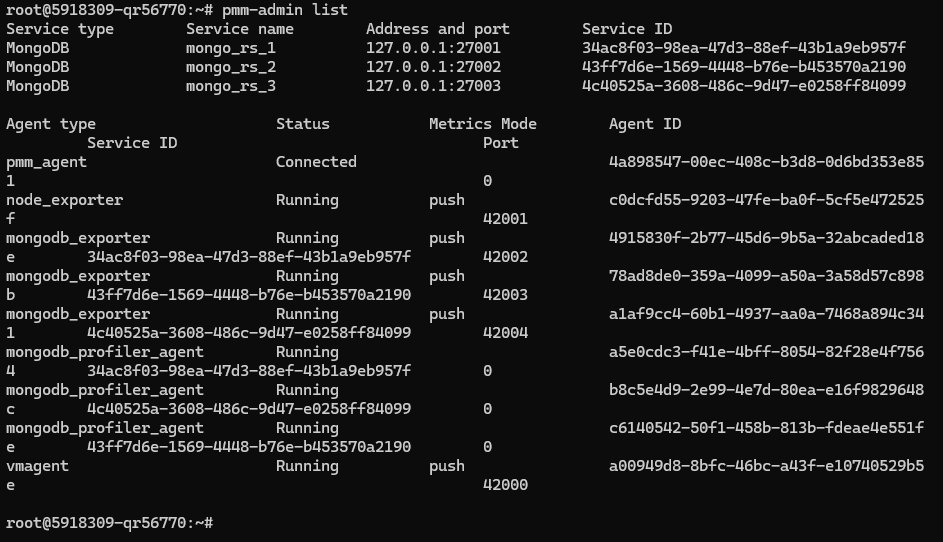
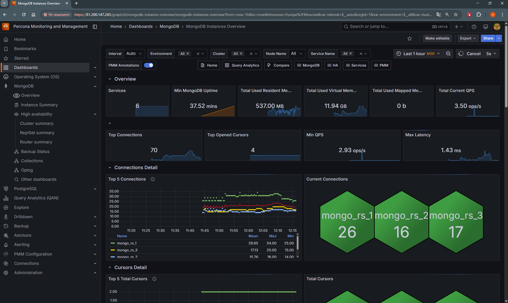
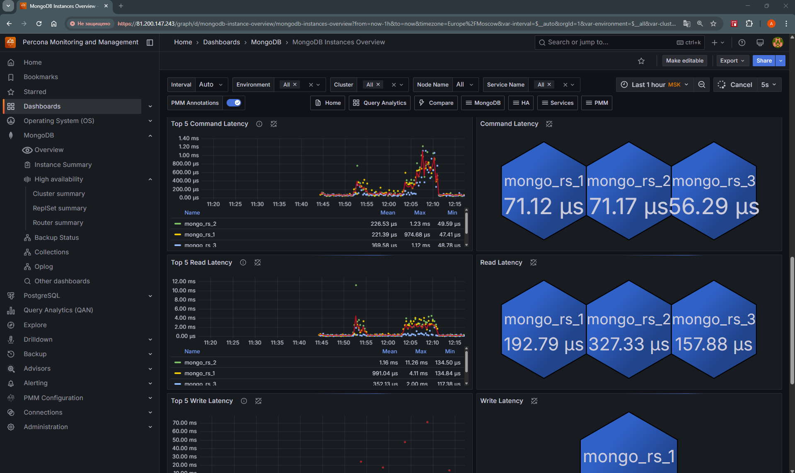
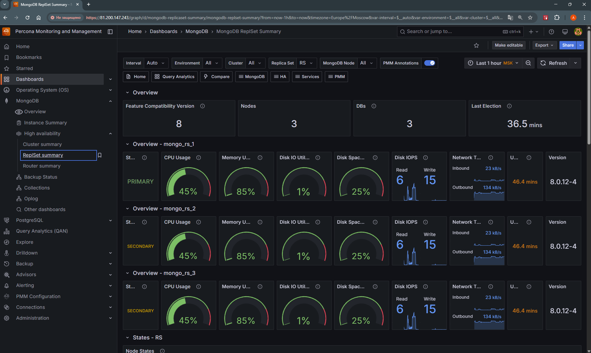

## Мониторинг MongoDB с помощью pmm:
#### Precondition: Установлен реплика сет Mongo DB, настроены роли и пользователи для pmm, а также ssl 
* Устанавливаем pmm
```shell
cd && wget https://www.percona.com/get/pmm
chmod +x pmm
./pmm
```
* Устанавливаем клиент pmm-client
```shell
cd ~ && wget https://repo.percona.com/apt/percona-release_latest.generic_all.deb
sudo dpkg -i percona-release_latest.generic_all.deb
sudo percona-release enable pmm3-client release
sudo apt update && sudo apt install -y pmm-client
```
* Регистриуем клиент
```shell
sudo pmm-admin config --server-insecure-tls --server-url=https://admin:secretpassword@@127.0.0.1:443
```
* Регистрируем монго в клиенте
```shell
pmm-admin add mongodb --username=pmm --password=pmm123@ --service-name=mongo_rs_1 --host=127.0.0.1 --port=27001 --enable-all-collectors
pmm-admin add mongodb --username=pmm --password=pmm123@ --service-name=mongo_rs_2 --host=127.0.0.1 --port=27002 --enable-all-collectors
pmm-admin add mongodb --username=pmm --password=pmm123@ --service-name=mongo_rs_3 --host=127.0.0.1 --port=27003 --enable-all-collectors
```
* Смотрим статус
```shell
pmm-admin list
```


* Заходим в UI pmm
https://81.200.147.243/graph/login

* Добавляем нагрузки на MongoDB RS, инсертим 1000 записей, делаем find
* Изучаем дашборды pmm


* 